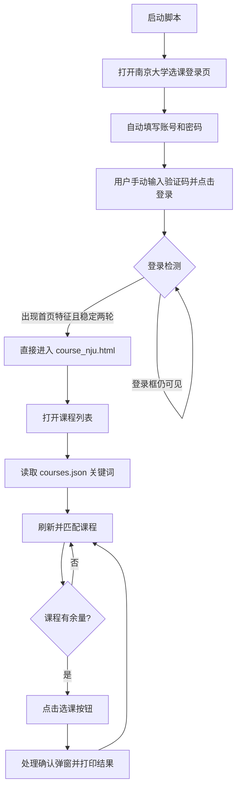

# NJU 研究生选课助手

一个基于 Selenium 的南京大学研究生选课页面自动化助手。它会打开 Chrome，自动填写账号密码，等待用户手动完成验证码并登录；确认登录成功后，自动进入 `course_nju.html`，按照 `courses.json` 中的关键词检测课程，并在课程有余量时尝试提交选课。

> 免责声明：本项目仅用于个人学习和自动化研究。请遵守南京大学选课系统的使用规定，不要高频刷新、恶意占用资源或进行任何未经授权的操作。选课结果以学校系统最终显示为准。

## 功能概览

| 功能 | 说明 |
| --- | --- |
| Chrome 自动启动 | 使用本机 Chrome 和 Selenium 驱动 |
| 自动填写账号密码 | 从本地 `config.json` 读取，不提交到仓库 |
| 人工验证码登录 | 脚本不会尝试识别或绕过验证码 |
| 登录状态识别 | 不再仅凭 `index_nju.html` 判断，而是检测登录框消失和首页特征 |
| 自动进入课程页 | 登录成功后直接跳转到 `course_nju.html` |
| 关键词匹配 | 从 `courses.json` 读取启用课程关键词 |
| 状态检测 | 区分“找到但已满”和“没有找到” |
| 自动选课 | 课程有余量时点击选课按钮并处理确认弹窗 |
| 详细日志 | 打印匹配结果、按钮状态、弹窗内容和网站反馈 |
| 安全测试模式 | `--dry-run` 只检测；`--test-click` 忽略“已满”文本，仅点击一次后退出 |

## 工作流程



### 登录状态判断

脚本不会因为 URL 变成 `index_nju.html` 就立即跳转。登录前后状态大致如下：

```text
登录前：可见登录框=2，首页文字特征=未发现，首页结构=False
登录后：可见登录框=0，首页文字特征=我的选课，首页结构=True
```

只有登录框不可见，并且检测到“我的选课”“退出”等首页特征，连续两轮成立后，脚本才会进入课程页。

## 环境要求

- Windows 10/11
- Python 3.10 或更高版本
- 已安装 Google Chrome
- 能够访问南京大学研究生选课系统

安装 Python 依赖：

```powershell
python -m pip install -r requirements.txt
```

## 配置

### 1. 创建本地账号配置

复制 `config.example.json` 为 `config.json`，再填写个人账号密码：

```json
{
  "UserId": "你的学号",
  "PassWd": "你的密码",
  "url": "https://yjsxk.nju.edu.cn"
}
```

`config.json` 已加入 `.gitignore`，不会被提交。请不要把账号密码粘贴到 README、Issue 或截图中。

### 2. 配置目标课程

编辑 `courses.json`：

```json
{
  "courses": [
    {
      "name": "高级编程语言设计与实现",
      "keywords": ["高级编程语言"],
      "enabled": true
    }
  ]
}
```

匹配规则是：课程行文本中包含任意一个启用关键词即可。建议使用稳定、独特的关键词，避免匹配到不想选的同名课程。

## 使用方式

### 安全检测模式

只检测课程，不点击选课按钮：

```powershell
python nju_yjsxk_btx.py --dry-run --timeout 120
```

### 正式运行模式

课程有余量时会实际点击选课并处理确认弹窗：

```powershell
python nju_yjsxk_btx.py --timeout 120
```

运行后：

1. Chrome 自动打开登录页并填写账号密码。
2. 用户手动输入验证码并点击登录。
3. 终端确认登录框消失、首页特征出现。
4. 脚本直接进入 `course_nju.html`。
5. 脚本按照随机间隔刷新并检测课程。

### 单次点击测试

如果课程当前显示“已满”，但需要验证按钮定位和点击流程，可以使用：

```powershell
python nju_yjsxk_btx.py --test-click --timeout 120
```

该模式会忽略课程行里的“已满”文字，对第一条关键词匹配课程执行一次实际点击，打印按钮属性和弹窗反馈，然后退出。它适合排查自动化流程，不代表学校系统会接受选课。

## 日志示例

### 找到课程但课程已满

```text
已启用课程关键词：高级编程语言
[课程匹配] 本轮找到 1 条关键词匹配课程。
[课程匹配 1] 已找到 [已满/不可选]：085212D28-高级编程语言设计与实现...
[选课动作 1] 跳过点击：课程已满或不可选。
[选课结果] 找到了关键词课程，但当前没有可选课程，继续刷新。
```

这表示关键词匹配成功，只是当前没有进入点击分支。

### 点击后网站返回失败原因

```text
[选课动作] 已点击选课按钮，等待确认弹窗。
[确认弹窗] 点击前内容：提示：该课程已满，暂时不能选课
[选课反馈] 提示：该课程已满，暂时不能选课
[选课结果] 失败-已满
```

### 点击后网站返回成功

```text
[选课动作] 已点击选课按钮，等待确认弹窗。
[确认弹窗] 点击前内容：确定选择该课程吗？
[选课反馈] 选课成功
[选课结果] 成功
```

## 命令行参数

| 参数 | 默认值 | 作用 |
| --- | ---: | --- |
| `--courses` | `courses.json` | 课程配置文件 |
| `--min-interval` | `10` | 最短刷新间隔，单位为秒 |
| `--max-interval` | `30` | 最长刷新间隔，单位为秒 |
| `--timeout` | `30` | 页面元素等待时间，单位为秒 |
| `--dry-run` | 关闭 | 只检测，不点击选课 |
| `--test-click` | 关闭 | 忽略“已满”文本，只点击第一条匹配课程一次 |

## 常见问题

### 为什么进入 `index_nju.html` 后没有立即跳转？

这是设计行为。这个站点的登录页和登录后的首页可能使用同一个 URL，因此脚本还会检查：

- 登录框是否仍然可见；
- 是否出现“我的选课”“退出”等登录后特征；
- 登录成功状态是否连续稳定两轮。

### 为什么显示“找到课程”但没有点击？

如果课程行包含“已满”“满额”“无余量”或“不可选”，脚本会打印“跳过点击”，这是正常保护逻辑。可以用 `--test-click` 单独验证按钮点击流程。

### 为什么点击后显示失败？

按钮点击成功只代表浏览器触发了页面操作，最终结果由学校系统业务规则决定。脚本会打印确认弹窗、提示框和失败分类，常见原因包括课程已满、时间冲突、先修条件不满足、重复选课等。

### Chrome 无法启动怎么办？

请先关闭正在运行的自动化 Chrome 窗口，再重试。脚本会为每次运行创建独立的 Chrome 配置目录，避免占用日常 Chrome 配置。若仍失败，请确认 Chrome 已正确安装，并检查 Python 与 ChromeDriver 版本是否匹配。

### 如何停止脚本？

在运行脚本的终端按 `Ctrl+C`。如果浏览器仍保持打开，按提示回车即可关闭。

## 项目文件

```text
nju-yjsxk-btx/
├─ nju_yjsxk_btx.py       # 自动登录、课程匹配、检测和选课
├─ courses.json           # 课程关键词配置
├─ config.example.json    # 配置模板，不含个人信息
├─ config.json            # 本地真实配置，不提交到 Git
├─ requirements.txt       # Python 依赖
├─ README.md              # 项目说明
└─ .gitignore             # 敏感配置与临时文件忽略规则
```

## 版本管理说明

本项目使用 Git 管理。提交前请确认：

```powershell
git status
git diff --check
```

并确认输出中没有 `config.json`、密码、验证码或 Chrome 配置目录。

## 许可证

当前仓库未附加开源许可证。除非仓库所有者另行说明，请将代码视为“保留所有权利”，仅作个人学习和研究使用。
