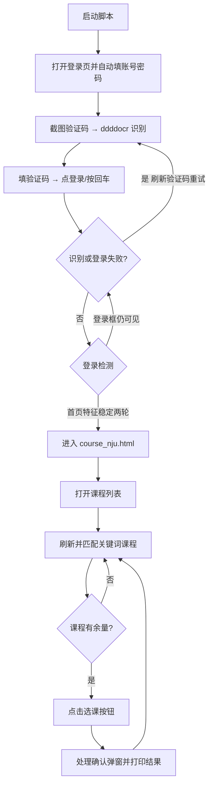
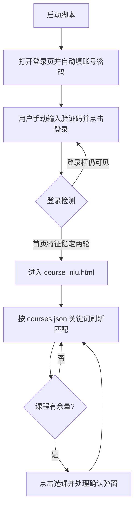

# NJU 研究生选课助手

一个基于 Selenium 的南京大学研究生选课页面自动化助手。它会打开 Chrome，自动填写账号密码，并按所选模式完成验证码登录：**无人值守模式**使用开源 ddddocr 自动识别验证码并自动提交登录（识别错误自动重试），**人工模式**由用户在浏览器中手动输入验证码并点击登录。登录成功后自动进入 `course_nju.html`，按照 `courses.json` 中的关键词持续检测课程，并在课程有余量时自动点击选课、处理确认弹窗。选课过程中若登录过期，会自动重新登录并恢复课程列表，全程可无人值守。

> 免责声明：本项目仅用于个人学习和自动化研究。请遵守南京大学选课系统的使用规定，请合理设置刷新间隔，不要高频刷新、恶意占用资源或进行任何未经授权的操作。选课结果以学校系统最终显示为准。

## 功能概览

| 功能 | 说明 |
| --- | --- |
| Chrome 自动启动 | 使用本机 Chrome 和 Selenium，每次运行使用独立的 Chrome 配置目录，不占用日常浏览器配置 |
| 自动填写账号密码 | 从本地 `config.json` 读取，不提交到仓库 |
| 两种验证码方式 | 加 `--use-login-helper`：ddddocr 自动识别（无人值守）；不加：人工输入 |
| 验证码识别重试 | 自动模式下识别错误/验证码错误会自动刷新重试，默认最多 6 次 |
| 弹窗自动关闭 | 自动关闭登录与选课过程中的弹窗，支持普通弹窗、iframe 内弹窗和 JS alert |
| 登录状态识别 | 检测登录框消失 + 首页特征（我的选课/退出登录/个人信息等），连续两轮稳定才判定成功 |
| 自动进入课程页 | 登录成功后自动跳转 `course_nju.html` |
| 会话过期自动恢复 | 选课过程中登录过期，自动重新登录并恢复课程列表，继续选课 |
| 关键词匹配 | 从 `courses.json` 读取启用课程关键词 |
| 状态检测 | 区分“找到但已满”和“没有找到” |
| 自动选课 | 课程有余量时点击选课按钮并处理确认弹窗 |
| 详细日志 | 打印匹配结果、按钮状态、弹窗内容和网站反馈 |
| 运行日志归档 | 每次运行自动保存带时间戳的日志到 `log/` |
| 任务状态持久化 | 每轮保存成功课程、待选目标、失败原因和刷新次数到 `state.json` |
| 安全测试模式 | `--dry-run` 只检测；`--test-click` 忽略“已满”文本，仅点击一次后退出 |

## 工作流程

### 无人值守模式（推荐，加 `--use-login-helper`）



### 人工验证码模式（不加 `--use-login-helper`）



### 登录状态判断

脚本不会因为 URL 变成 `index_nju.html` 就立即跳转。登录前后状态大致如下：

```text
登录前：可见登录框=2，首页文字特征=未发现，首页结构=False
登录后：可见登录框=0，首页文字特征=我的选课，首页结构=True
```

只有登录框不可见，并且检测到“我的选课”“退出登录”等首页特征，连续两轮成立后，脚本才会进入课程页。

## 环境要求

- Windows 10/11
- Python 3.10 或更高版本
- 已安装 Google Chrome
- 能够访问南京大学研究生选课系统

安装 Python 依赖：

```powershell
python -m pip install -r requirements.txt
```

依赖包括：`selenium`（浏览器自动化）、`ddddocr`（离线验证码识别）、`requests`（可选，sai 实验功能使用）。

## 配置

### 1. 创建本地账号配置

复制 `config.example.json` 为 `config.json`，再填写个人账号密码：

```json
{
  "UserId": "你的学号",
  "PassWd": "你的密码",
  "url": "https://yjsxk.nju.edu.cn"
}
```

`config.json` 已加入 `.gitignore`，不会被提交到仓库。请不要把账号密码粘贴到 README、Issue 或截图中。

### 2. 配置目标课程

编辑 `courses.json`：

```json
{
  "courses": [
    {
      "name": "高级编程语言设计与实现",
      "keywords": ["高级编程语言"],
      "enabled": true
    }
  ]
}
```

匹配规则是：课程行文本中包含任意一个启用关键词即可。建议使用稳定、独特的关键词，避免匹配到不想选的同名课程。

## 使用方式

所有模式都通过主脚本 `nju_yjsxk_btx.py` 运行。完整参数：

| 参数 | 默认值 | 说明 |
| --- | --- | --- |
| `--courses` | `courses.json` | 课程关键词配置文件路径 |
| `--min-interval` | `60` | 最短刷新间隔（秒） |
| `--max-interval` | `300` | 最长刷新间隔（秒） |
| `--timeout` | `30` | 页面元素等待超时（秒） |
| `--dry-run` | 关闭 | 只检测课程，不点击选课 |
| `--test-click` | 关闭 | 忽略“已满”文字，仅点击第一条匹配课程一次后退出 |
| `--missing-rounds` | `5` | 连续多少轮找不到目标关键词后退出 |
| `--use-login-helper` | 关闭 | 使用 login_helper + ddddocr 全自动登录（无人值守） |
| `--login-max-attempts` | `6` | 自动登录最大尝试次数 |

### 无人值守模式（推荐）

自动识别验证码、自动登录、自动选课，全程无需人工：

```powershell
python nju_yjsxk_btx.py --use-login-helper --courses courses.json
```

运行过程：

1. Chrome 打开登录页，自动填入账号密码。
2. 自动截图验证码，`captcha_ocr.py`（ddddocr）离线识别，结果强制大写。
3. 自动填入验证码并提交：优先点击登录按钮，找不到按钮时自动在输入框按回车提交。
4. 若是验证码识别错误或提示“验证码不正确”，自动点击验证码刷新并重试，最多 `--login-max-attempts` 次（默认 6 次）。
5. 登录成功后自动进入 `course_nju.html`。
6. 按随机间隔刷新并检测课程，有余量自动点击选课、处理确认弹窗。
7. 选课过程中登录过期，自动重新登录并恢复课程列表，继续选课。

### 人工验证码模式

只自动填账号密码，验证码由人工输入并手动点击登录，其余流程自动：

```powershell
python nju_yjsxk_btx.py --courses courses.json
```

运行后：

1. Chrome 自动打开登录页并填写账号密码。
2. 用户在浏览器中手动输入验证码并点击登录。
3. 终端确认登录框消失、首页特征出现后，脚本进入 `course_nju.html`。
4. 脚本按随机间隔刷新并检测课程，有余量自动选课。

### 安全检测模式

只检测课程，不点击选课按钮：

```powershell
python nju_yjsxk_btx.py --dry-run --use-login-helper
```

### 单次点击测试

如果课程当前显示“已满”，但需要验证按钮定位和点击流程，可以使用：

```powershell
python nju_yjsxk_btx.py --test-click --use-login-helper
```

该模式会忽略课程行里的“已满”文字，对第一条关键词匹配课程执行一次实际点击，打印按钮属性和弹窗反馈，然后退出。它适合排查自动化流程，不代表学校系统会接受选课。

## 验证码识别模块（captcha_ocr.py）

- 基于开源 [ddddocr](https://github.com/sml2h3/ddddocr)，纯离线本地识别，不需要联网。
- 识别结果强制大写，只保留字母和数字。
- 默认读取 `captcha_screenshots/` 目录里最新的一张图片，也可指定图片路径。

单独测试验证码识别：

```powershell
python captcha_ocr.py                        # 识别 captcha_screenshots 最新图
python captcha_ocr.py 某图片.png             # 识别指定图片
```

代码内调用：

```python
from captcha_ocr import recognize_image
code = recognize_image("captcha_screenshots/1.png")
```

## 登录实现说明（login_helper.py）

主脚本在加了 `--use-login-helper` 时，通过 `login()` 调用 `login_helper.perform_login()` 完成登录，主要能力：

- **自动识别**：截图验证码 → `captcha_ocr` 识别 → 填入 → 提交（优先点登录按钮，找不到按钮自动按回车）。
- **失败重试**：验证码识别为空或页面提示“验证码不正确”“密码错误”等，自动刷新验证码重试，最多 `--login-max-attempts` 次。
- **弹窗自动关闭**：登录过程中出现的普通弹窗、iframe 内弹窗、JS alert 都会自动点击关闭，避免遮挡登录。
- **登录成功判定**：登录框消失且首页特征连续两轮稳定，才认为登录成功。

`login_helper.py` 也可以单独运行：

```powershell
python login_helper.py                        # 自动 OCR 登录
python login_helper.py --manual               # 人工输入验证码
python login_helper.py --capture-only         # 只填账号并截图验证码
python login_helper.py --max-attempts 8       # 自定义重试次数
```

## 会话过期自动恢复

选课过程中如果登录过期（页面出现“未登录不能选课”“登录超时”，或重新出现登录框），主脚本会自动执行：

1. 先把当前任务进度写入 `state.json`。
2. 自动跳回登录页，通过 login_helper 自动重新登录（OCR 识别验证码，失败自动重试）。
3. 登录成功后自动回到 `course_nju.html`，重新定位方案课程列表。
4. 继续原来的选课循环，已选成功的课程和剩余待选目标都不丢失。

整个过程无需人工干预，可长时间挂机。

## 日志示例

### 找到课程但课程已满

```text
[刷新] 第 11 次刷新开始；距离上一轮刷新 0.0 秒。
[课程匹配] 本轮找到 8 条待选关键词课程；剩余目标：高级编程语言, 软件安全, ...
[课程匹配 1] 已找到 [已满/不可选]：085212D28-高级编程语言设计与实现 ... 已满 选课
[选课动作 1] 跳过点击：课程已满或不可选。
[选课结果] 找到了关键词课程，但当前没有可选课程，继续刷新。
[等待] 下一轮刷新将在 166.9 秒后开始。
```

### 自动登录与验证码重试

```text
[登录尝试] 第 1/6 次
[OCR] 识别结果：VAN
[登录检测] 页面提示：验证码不正确
[登录尝试] 本次未成功（验证码不正确），刷新验证码重试。
[登录尝试] 第 2/6 次
[OCR] 识别结果：F4P6
登录成功。当前URL=https://yjsxk.nju.edu.cn/yjsxkapp/sys/xsxkapp/index_nju.html
已进入课程页面，开始检测课程。
```

### 选课成功

```text
[选课动作] 找到有余量课程，准备点击选课按钮：...
[确认弹窗] 点击前内容：确认选择该课程？
[选课成功] 已完成目标：高级编程语言；剩余目标：软件安全, ...
```

### 会话过期自动恢复

```text
[会话] 检测到登录已失效，已保存 state.json。
[会话] 正在重新打开登录页；使用 login_helper 自动重新登录（OCR 识别验证码）。
[登录尝试] 第 1/6 次
[OCR] 识别结果：Q9YS
[登录尝试] 验证码：Q9YS
已按回车提交登录；等待登录结果。
登录成功。当前URL=.../index_nju.html
[会话] 重新登录成功，已恢复课程列表和待选目标。
```

## 常见问题

### 为什么进入 `index_nju.html` 后没有立即跳转？

这是设计行为。这个站点的登录页和登录后的首页可能使用同一个 URL，因此脚本还会检查：

- 登录框是否仍然可见；
- 是否出现“我的选课”“退出”等登录后特征；
- 登录成功状态是否连续稳定两轮。

### 为什么显示“找到课程”但没有点击？

如果课程行包含“已满”“满额”“无余量”或“不可选”，脚本会打印“跳过点击”，这是正常保护逻辑。可以用 `--test-click` 单独验证按钮点击流程。

### 为什么点击后显示失败？

按钮点击成功只代表浏览器触发了页面操作，最终结果由学校系统业务规则决定。脚本会打印确认弹窗、提示框和失败分类，常见原因包括课程已满、时间冲突、先修条件不满足、重复选课等。失败后目标课程默认保留，下一轮继续尝试。

### 验证码识别错了怎么办？

自动模式下脚本会检测到“验证码不正确”等提示，自动刷新验证码重试，默认最多 6 次（可用 `--login-max-attempts` 调整）。个别情况下 ddddocr 识别率偏低，可以多试几次或改用人工验证码模式：`python nju_yjsxk_btx.py`（不加 `--use-login-helper`）。

### 登录时弹出弹窗挡住登录怎么办？

脚本会自动检测并关闭登录过程中的弹窗，包括普通弹窗、iframe 内弹窗和 JS alert，然后自动重新点击登录或按回车提交。

### 选课过程中登录过期了怎么办？

脚本会自动检测登录失效并重新登录，然后回到课程页继续选课，无需人工处理，详见“会话过期自动恢复”。

### Chrome 无法启动怎么办？

请先关闭正在运行的自动化 Chrome 窗口，再重试。脚本会为每次运行创建独立的 Chrome 配置目录，避免占用日常 Chrome 配置。若仍失败，请确认 Chrome 已正确安装，并检查 Python 与 ChromeDriver 版本是否匹配。

### 如何停止脚本？

在运行脚本的终端按 `Ctrl+C`。如果浏览器仍保持打开，按提示回车即可关闭。

## 项目文件

```text
nju-yjsxk-btx/
├─ nju_yjsxk_btx.py       # 主脚本：登录（可选 OCR）、课程匹配、检测和选课
├─ login_helper.py        # 登录辅助模块：截图/OCR 接入/失败重试/弹窗关闭/回车兜底
├─ captcha_ocr.py         # 验证码识别模块（ddddocr），可独立运行或代码调用
├─ courses.json           # 课程关键词配置
├─ config.example.json    # 配置模板，不含个人信息
├─ config.json            # 本地真实配置，不提交到 Git
├─ requirements.txt       # Python 依赖（selenium / ddddocr / requests）
├─ README.md              # 项目说明
└─ .gitignore             # 敏感配置与临时文件忽略规则
```

## 版本管理说明

本项目使用 Git 管理。提交前请确认：

```powershell
git status
git diff --check
```

并确认输出中没有 `config.json`、密码、验证码或 Chrome 配置目录。

## 许可证

本项目采用 [MIT License](https://github.com/strawberry-little-bear/nju-yjsxk-btx/blob/main/LICENSE)。许可证全文请参阅仓库根目录的 `LICENSE` 文件。
